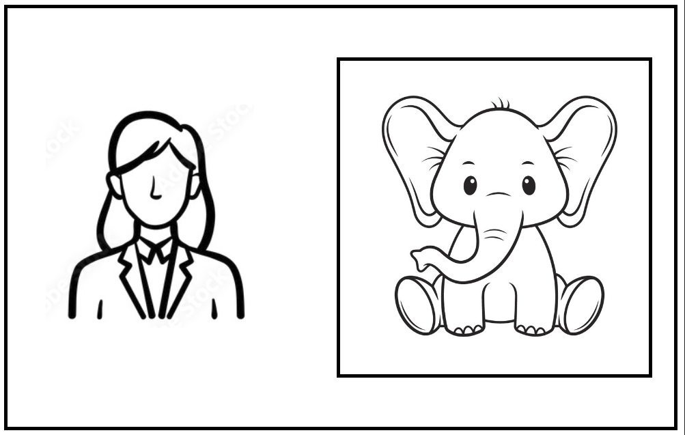
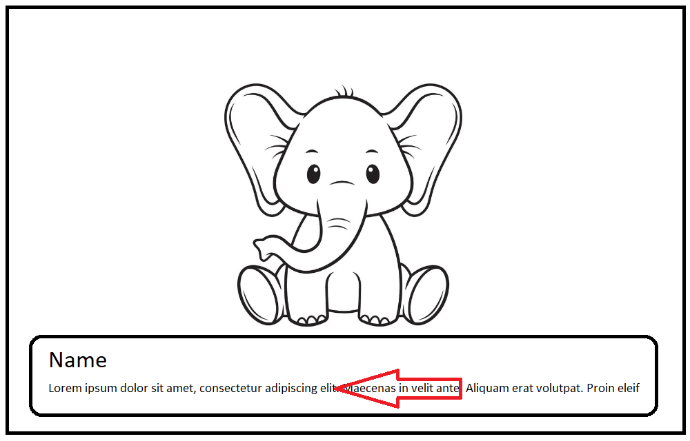
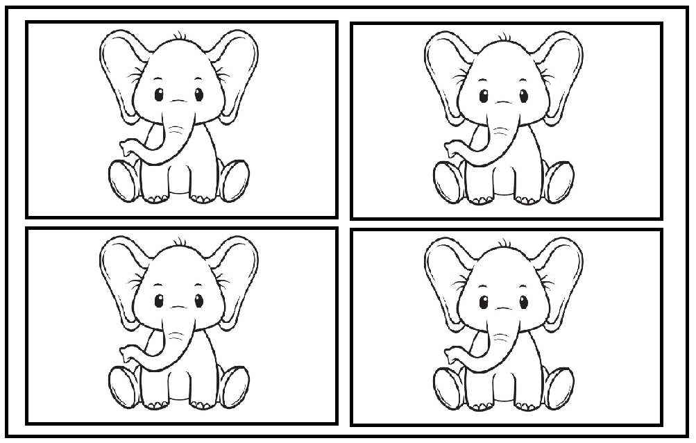

---
aliases:
tags:
  - AU/thesis/user-study
creation date: 2024-04-24 16:12
---
## Task 1
In the first task, you have to create a short highlight video for the start of a Formula 1 race.
- Add the "F1 highlights" clip to the timeline.
- Add the “F1 onboard” clip as well - it should be small, in the bottom right corner and start around second 3
- Add a black box with rounded edges on the top left, which says “Formula 1“, then “Lap 1/56” below it. It should start at second 1 and last until the end of the video and slide in from the left when it appears on the screen.

## Task 2 - Baby Elephant news
In the local zoo, four cute baby elephants were born this year. Your task is to cut a short news report that introduces them.
### Scene 1
The first scene should contain the news reporter talking. While doing so, a generated image of a cute baby elephant should float in from the right as an illustration. The image should be cropped to it's center with a 1:1 aspect ratio.

### Scene 2
In the second scene the 4 baby elephants should be shown one after another. The clips for each elephants should be cut sequentially. Over each clip, add a banner on the bottom with two rows of text. The first row of the banner should contain the name of the elephant with large font size, while the second row should contain sliding text from right to left containing a description about the elephant.

The elephant's names and their short description:
- Daisy: Daisy loves spending her time at the local spa.
- Cosmo: Cosmo is a true sportsman. His speed and endurance is going to get him to the world cup one day.
- Sandra: Sandra's obsession with fountains just makes her more adorable.
- Louis: For Louis there's no greater joy than having a good nap. Anytime. Anywhere.

`Hint`: Once the first banner is created try to add it as a reusable element so that it can be imported and modified for the rest of the elephants.

### Scene 3
In the final scene you should create a 2x2 grid view containing the clips of each baby elephant. This scene should be 12 seconds long. 

## Task 3
// TODO: Jedrek

